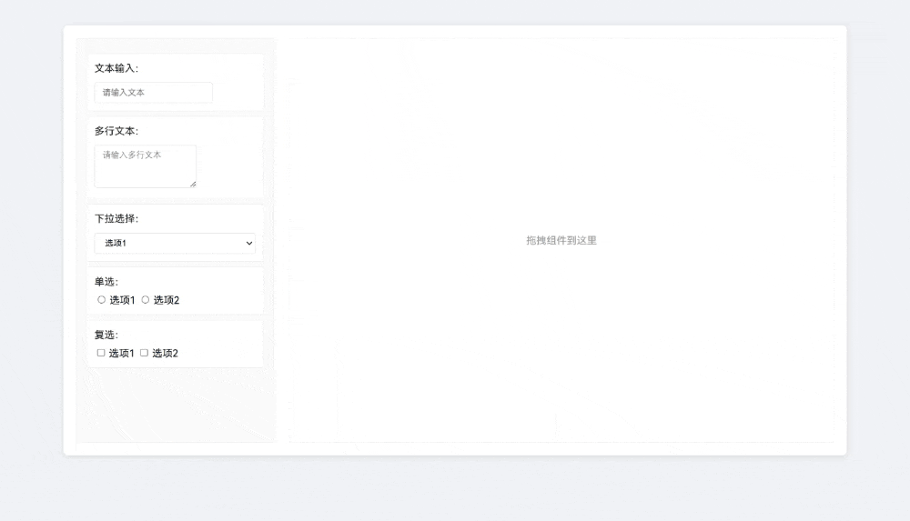
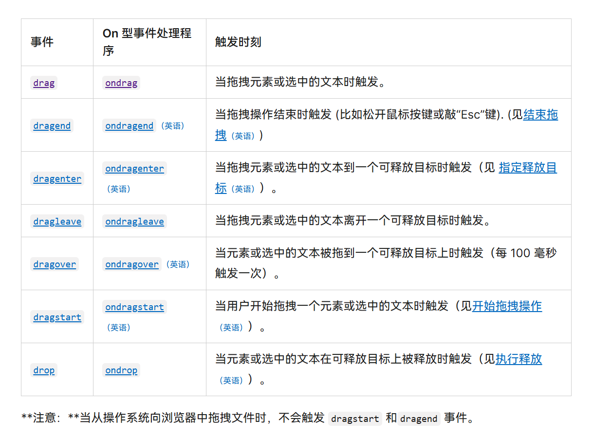

# 实现拖拽表单demo

# 最终效果



# 需要知道的一些拖拽API

这部分知识建议查看[MDN](https://developer.mozilla.org/zh-CN/docs/Web/API/HTML_Drag_and_Drop_API)，这是其中的一些关键api，我截取一部分给大家：



---

这里我也列举几个比较关键的地方，帮助大家降低阅读的难度

- **开启元素的拖拽功能**：
    
    要使 HTML 元素可拖拽，需在该元素上添加 `draggable="true"` 属性。例如：
    
    ```html
    html
    复制代码
    <div draggable="true" data-type="text">可拖拽元素</div>
    
    ```
    
- **在拖放操作中存储和读取数据**：
    
    使用 `dataTransfer` 对象来存储和读取传输的数据。在 `dragstart` 事件中，可以用 `setData` 方法设置数据类型和对应的数据，方便在 `drop` 事件中通过 `getData` 方法读取这些数据。
    
- **示例代码解释**：
    - `data-type="text"` 属性表示传入的数据是 `'text'`。
    - `e.dataTransfer.setData('text/plain', this.dataset.type);` 用于将数据类型 `'text/plain'` 和内容 `this.dataset.type` 存入拖拽数据中。
    - `e.dataTransfer.getData('text/plain');` 在 `drop` 事件中调用，用来读取拖拽时传输的数据，返回 `"text"`。
- **代码示例**：
    
    ```html
    <div draggable="true" data-type="text" ondragstart="handleDrag(event)">拖拽我</div>
    ```
    
    ```jsx
    function handleDrag(e) {
        // 设置拖拽数据，类型为 text/plain，数据内容为元素的 data-type 属性值
        e.dataTransfer.setData('text/plain', e.target.dataset.type);
    }
    
    function handleDrop(e) {
        // 获取拖拽数据
        const data = e.dataTransfer.getData('text/plain');
        console.log(data); // 输出 "text"
    }
    ```
    

# 思路讲解

这个拖拽的实现其实并不复杂，主要可以分为两部分，左边的**组件列表**和右边生成的**表单**

> css样式部分比较多，就不在文中展示了，需要的同学可以去[GitHub](https://github.com/ccchur/dragForm)上看一下（就一个html，很简单的！），觉得还不错的话，也可以star⭐一下哦~
> 

## 1. 组件列表

组件列表其实非常简单，就是一个组件的list

html完整代码实例：

<aside>
💡

`id= componentList` 部分为组件列表，`id=formArea` 部分为表单区域

</aside>

```html
<div class="container">
        <div class="components" id="componentList">
            <div class="component-item" draggable="true" data-type="text">
                <label>文本输入：</label>
                <input type="text" placeholder="请输入文本">
            </div>
            
            <div class="component-item" draggable="true" data-type="textarea">
                <label>多行文本：</label>
                <textarea placeholder="请输入多行文本"></textarea>
            </div>
            
            <div class="component-item" draggable="true" data-type="select">
                <label>下拉选择：</label>
                <select>
                    <option>选项1</option>
                    <option>选项2</option>
                </select>
            </div>
            
            <div class="component-item" draggable="true" data-type="radio">
                <label>单选：</label>
                <input type="radio" name="radio">选项1
                <input type="radio" name="radio">选项2
            </div>
            
            <div class="component-item" draggable="true" data-type="checkbox">
                <label>复选：</label>
                <input type="checkbox">选项1
                <input type="checkbox">选项2
            </div>
            
        </div>
        <div class="form-area" id="formArea"></div>
    </div>
```

组件列表中，我们需要监听所有的组件是否被拖拽，并且传入相对应的值（`”text”, ”textarea”`等）

```jsx
const componentList = document.getElementById('componentList');

 // 为组件列表项添加拖拽事件
componentList.querySelectorAll('.component-item').forEach(item => {
    item.addEventListener('dragstart', function(e) {
        e.dataTransfer.setData('text/plain', this.dataset.type);
    });
});
```

## 2. 表单区域

在表单区域内的操作相比于组件列表更加复杂

需要处理的事情有：

- 更具组件列表拖拽过来的组件生成相对应的组件
- 当区域内有多个组件，判断当前拖拽组件的位置，将其插入当前位置组件的上/下方
- 在区域内拖拽时，需要出现一条当前位置指示线来提醒用户当前组件插入位置

我们可以大体写出以下这些监听函数（**把大体思路定下来，再去写具体操作**）


### 监听拖入的组件

<aside>
💡

**`closest()`**：这是一个 DOM 方法，接受一个 CSS 选择器字符串作为参数。从 `e.target` 元素开始，`closest()` 会逐级向上查找祖先元素，直到找到匹配选择器的第一个元素。如果找到匹配的祖先元素，则返回该元素；如果没有找到，则返回 `null`。

---

总而言之就是：
`closest('.form-item')` 会从当前元素 `e.target` 开始，一层一层地向上查找，直到找到第一个匹配 `.form-item` 类的祖先元素。

</aside>

```jsx
// 当前位置指示线
let insertIndicator = document.createElement('div');
insertIndicator.className = 'insert-indicator';

// 表单区域的拖拽事件
formArea.addEventListener('dragover', function(e) {
    // 阻止默认行为
    e.preventDefault();
    // 停止事件传播
    e.stopPropagation();
    
    // 获取当前拖拽下方已经生成的表单组件
    const closestItem = e.target.closest('.form-item');
    // 判断有没有表单组件，决定显不显示位置指示线
    if (closestItem) {
		    // 获取当前下方元素
        const rect = closestItem.getBoundingClientRect();
        // 获取下方元素的中心位置
        const middle = rect.top + rect.height / 2;
        
        if (e.clientY < middle) {
		        // 前方插入
            closestItem.before(insertIndicator);
        } else {
		        // 后方插入
            closestItem.after(insertIndicator);
        }
        // 显示指示线
        insertIndicator.style.display = 'block';
    }
});
```

### 生成表单组件

当鼠标拖入之后，拖拽监听事件会监听到（包括我们之前在html元素处设置传入的变量”text”这些），并且触发回调。

<aside>
💡

这里先写创建的函数，真正插入画面的时候需要在监听事件中调用，因为我们**需要使用排序的事件来判断应该在哪里生成插入**

</aside>

```jsx
// 创建表单项
function createFormItem(type) {
    const div = document.createElement('div');
    div.className = 'form-item';
    div.draggable = true;

    // 添加删除按钮
    const deleteBtn = document.createElement('span');
    deleteBtn.className = 'delete-btn';
    deleteBtn.innerHTML = '×';
    deleteBtn.onclick = function() {
        div.remove();
    };

    let content = '';
    switch(type) {
        case 'text':
            content = '<label>文本输入：</label><input type="text">';
            break;
        case 'textarea':
            content = '<label>多行文本：</label><textarea></textarea>';
            break;
        case 'select':
            content = '<label>下拉选择：</label><select><option>选项1</option><option>选项2</option></select>';
            break;
        case 'radio':
            content = '<label>单选：</label><input type="radio" name="radio">选项1 <input type="radio" name="radio">选项2';
            break;
        case 'checkbox':
            content = '<label>复选：</label><input type="checkbox">选项1 <input type="checkbox">选项2';
            break;
    }

    div.innerHTML = content;
    div.appendChild(deleteBtn);

    // 添加表单项的拖拽排序功能
    div.addEventListener('dragstart', function(e) {
        e.dataTransfer.setData('text/plain', 'move');
        this.style.opacity = '0.4';
    });

    div.addEventListener('dragend', function(e) {
        this.style.opacity = '1';
    });

    return div;
}
```

这里的代码很好理解，就是做一个判断，根据传入的type来生成对应的元素组件

<aside>
💡

需要注意的是，在表单区域也需要实现拖拽排序的功能，因此需要给我们生成的组件添加拖拽监听！并且需要传入“move”变量，来标识当前元素在表单区域拖拽释放的时候不用生成

(在下面拖拽排序代码中更好理解)

</aside>

### 拖拽排序

有两个时机需要触发排序：

- 当在在左侧组件列表拖入的时候
- 表单区域内拖动的时候

<aside>
💡

当左侧拖入的时候，不仅仅需要排序，还需要生成

当只在表单区域内排序的时候不用生成

这两种情况我们用`e.dataTransfer.getData('text/plain')` 来判断是否需要生成新元素

</aside>

拖拽开始的时候监听，找到拖动的当前元素：

```jsx
// 表单项之间的排序
let draggedItem = null;
// 拖拽开始
formArea.addEventListener('dragstart', function(e) {
    draggedItem = e.target.closest('.form-item');
});
```

在表单区域拖动的时候，也需要监听：

<aside>
💡

在这里需要注意的是，**拖入生成新元素的排序和在表单区域内的排序有些不同之处！**

</aside>

1. 在左侧拖入的时候，**排序是发生在还没有生成表单项的时候**，即表单区域内的原有的表单项不需要发生移动，因此**只用判断当前鼠标下方的元素的和鼠标的位置即可**

.gif)

1. 如果只是在表单区域内排序的时候，**移动的表单项是已经存在了**，此时的情况是这样的
    - 鼠标在**当前拖动的元素**上时
    - 鼠标在**其他表单项元素**上时

虽然有两种不同的情况，但是，我们判断的逻辑还是一样的，用当前鼠标的位置和当前**目标元素（当前拖动的元素/其他元素）**的中心线位置来判断。

.gif)

在formArea上拖拽移动的代码

> **`closestItem.nextSibling`**： `closestItem` 元素的下一个兄弟节点。
> 

```jsx
// 在formArea上拖拽移动
formArea.addEventListener('dragover', function(e) {
    e.preventDefault();
    if (!draggedItem) return;
    
    const closestItem = e.target.closest('.form-item');
    if (closestItem && closestItem !== draggedItem) {
        const rect = closestItem.getBoundingClientRect();
        const middle = rect.top + rect.height / 2;
        if (e.clientY < middle) {
            formArea.insertBefore(draggedItem, closestItem);
        } else {
            formArea.insertBefore(draggedItem, closestItem.nextSibling);
        }
    }
});
```

拖拽释放&结束时的监听：

- 判断是否需要新生成表单项
- 目标元素恢复为空
- 指示条消失

```jsx
// 监听拖拽释放
formArea.addEventListener('drop', function(e) {
    // 阻止默认行为
    e.preventDefault();
    // 停止事件传播
    e.stopPropagation();
    // 获取当前类型
    const type = e.dataTransfer.getData('text/plain');
    // 如果是"move"表示是移动操作，不是左边拖入，不需要生成新的表单项
    if (type && type !== 'move') {
        const formItem = createFormItem(type);
        if (insertIndicator.style.display === 'block') {
            insertIndicator.replaceWith(formItem);
        } else {
            formArea.appendChild(formItem);
        }
    }
    insertIndicator.style.display = 'none';
});

// 拖拽结束
formArea.addEventListener('dragend', function() {
    draggedItem = null;
    insertIndicator.style.display = 'none';
});
```

### 其他事件监听

拖拽离开表单区域，需要取消指示条

```jsx
// 监听拖拽离开
formArea.addEventListener('dragleave', function(e) {
    if (!formArea.contains(e.relatedTarget)) {
        insertIndicator.style.display = 'none';
    }
});
```

# 总结

到这里就是一个拖拽生成表单demo的全部内容了，本文仅仅只是介绍了实现拖拽生成的思路，并不是一个完整功能的项目。

在此demo上可以不断完善，或者扩展功能，如表单的配置，导出等功能：


---

**参考源码：**

- https://github.com/ccchur/dragForm (觉得还不错的话，也可以star⭐一下哦~)